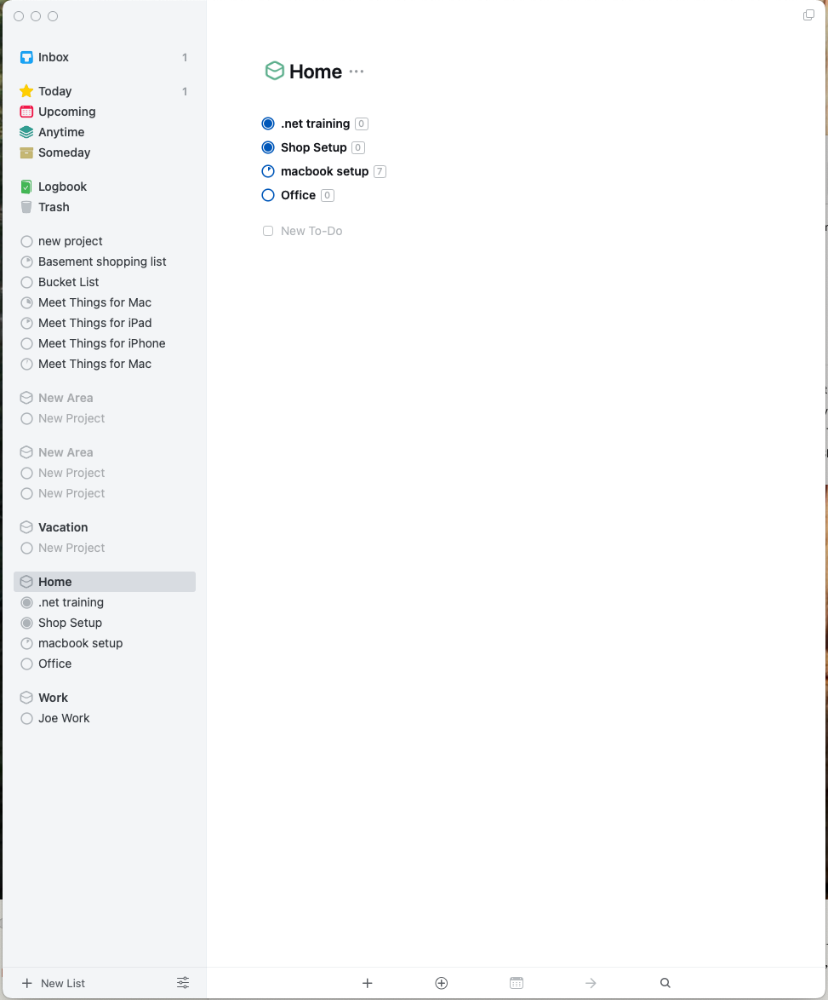

# Design Reference Guide

This folder contains all visual design references for the Things 3 clone application.

## Screenshots and Visual References

### Main Interface

*Complete application interface showing all major components*

### View Types

#### Area Views

*Area view showing project overview with statistics and project cards*

#### Project Views

*Project view showing hierarchical task organization with section headers*

### Interactive Elements

#### Task Editing

*Inline task editing functionality*

#### Project Creation

*Project creation workflow*

### Dropdown Menus

#### Area Dropdown

*Context menu for area actions with dark theme*

#### New List Dropdown

*Dropdown for creating new areas and projects*

#### Project Menu

*Context menu for project actions and settings*

## Design System

The complete design system specification is available in `things3-design-system.json`, which includes:

- **Color Palette**: Primary, secondary, and semantic colors
- **Typography**: Font families, sizes, and weights
- **Spacing**: Consistent spacing scale
- **Components**: Styling specifications for all UI components
- **Interactions**: Hover states, focus states, and animations

## Usage Guidelines

1. **Exact Color Matching**: Use only colors defined in the design system
2. **Consistent Spacing**: Follow the spacing scale for margins and padding
3. **Typography Hierarchy**: Maintain consistent font sizes and weights
4. **Component Styling**: Match the exact styling shown in screenshots
5. **Interactive States**: Implement all hover and focus states as shown

## Implementation Notes

- All images are referenced in the static HTML implementation
- Colors are implemented as CSS custom properties
- Layout patterns should match the screenshots exactly
- Interactive behaviors are documented in the task breakdown files